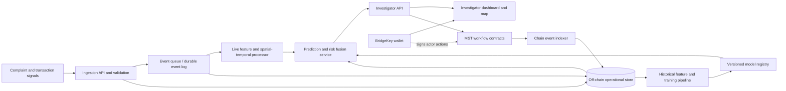
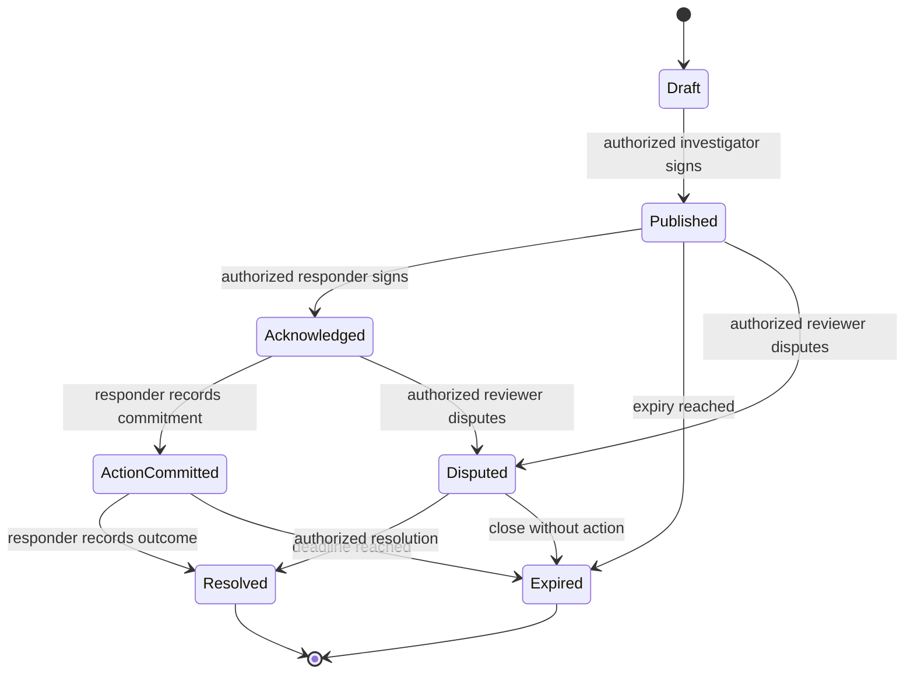

# TracePoint Architecture

## System Objective

TracePoint combines historical complaint patterns with newly received, time-stamped signals to rank likely future cash-out zones and useful intervention windows (+2h, +6h, +24h). It is an investigator decision-support system: it prioritizes review and coordinated response, does not identify a person as guilty, and does not autonomously freeze accounts or dispatch officers.

When authorized NCRP, bank, payment, or ATM data is unavailable, the demo runs on synthetic data and visibly marks every affected dashboard, event, prediction, and evaluation as `SYNTHETIC`. Demo performance is not evidence of operational accuracy.

## High-Level Architecture

The operational path is off-chain: source intake, sensitive record handling, feature computation, model inference, and map rendering. The MST layer records authorized coordination and workflow transitions with actor signatures. The indexer reconciles contract events into the application view. No raw source record or precise predicted location is required by the contract.

## Main Components and Responsibilities

| Component | Responsibilities |
| --- | --- |
| Ingestion gateway | Authenticate source integrations; validate schemas, timestamps, provenance, and source class; apply rate limits and idempotency; reject or quarantine malformed events. |
| Durable event log | Buffer accepted events, support replay, preserve ordering metadata, and decouple source availability from processing. For a small demo this may be a database-backed queue, behind an interface suitable for a broker later. |
| Off-chain operational store | Store complaints, transactions, identities, exact coordinates, evidence, feature snapshots, model outputs, and investigation notes under access control and retention rules. |
| Historical pipeline | Normalize records, deduplicate, create time-safe training examples, generate spatial/temporal aggregates, and evaluate models on chronological holdouts. |
| Model registry | Track model artifact/version, feature contract, training-data provenance, evaluation results, and approval status. |
| Live processor | Update rolling counts/amounts and signal recency by zone and event-time window; handle late and duplicate events; emit feature updates and anomalies. |
| Prediction service | Score candidate zones/horizons with the historical model, compute event-driven propagation, fuse the two signals, and return ranked results with provenance and uncertainty. |
| Investigator API/UI | Provide ranked zones, horizon comparisons, map overlays, supporting factors, source/data-quality labels, case links, and authorized action workflow. |
| MST contracts | Record alert publication, acknowledgment, assigned response commitments, intervention status, and resolution/dispute transitions with role checks and auditable actor signatures. |
| BridgeKey integration | Connect an investigator or agency wallet and request signatures for permitted MST workflow actions. Wallet identity proves control of a key, not legal identity or data authorization by itself. |
| Chain indexer | Consume contract events, verify confirmations, reconcile workflow state, and update off-chain operational projections. |

## End-to-End Data Flow

1. A source adapter submits a complaint or transaction-related signal with a source ID, event timestamp, receipt timestamp, jurisdiction, and provenance class (`REAL_AUTHORIZED`, `SYNTHETIC`, or `MANUAL_DEMO`).
2. The gateway authenticates the source, validates fields and coordinate bounds, assigns an idempotency key, and records whether the signal is permitted for operational use. Synthetic/demo data remains explicitly labeled through every downstream stage.
3. The raw record is encrypted and stored off-chain. A normalized, minimized event is appended to the durable event log. The chain receives no raw event.
4. The live processor updates rolling features and candidate zone/time-window scores. The historical pipeline independently updates eligible training data and model evaluations; it does not silently retrain or promote a model in response to an event.
5. The prediction service creates a versioned prediction snapshot for each requested or triggered forecast. It returns ranked candidate zones for +2h, +6h, and +24h, plus the score breakdown, data freshness, model version, synthetic/real label, and uncertainty/coverage information.
6. The investigator reviews the result and chooses whether to publish an alert on MST. Publishing includes only a non-sensitive alert reference, coarse jurisdiction/zone identifier, horizon, risk band, expiry, model/ruleset version, and a commitment to the off-chain snapshot.
7. Authorized responders acknowledge the alert and record an operational commitment or status transition using BridgeKey signing. Detailed assignment, location, case notes, and intervention evidence remain off-chain.
8. Chain events are indexed back into the application. Investigators see the coordinated status and signatures alongside authorized off-chain case details. Resolution/outcome data can later inform reviewed evaluation datasets.

## ML Prediction Flow

### Historical Model

Start with a supervised area-level cash-out-risk baseline inspired by Sarthak. The prediction target must be explicitly defined (for example, a verified cash-out event in a specified zone and future interval), and features must be available at the prediction cutoff. Candidate features include prior complaint/cash-out counts, transaction amount bands, report delay, channel/category, cash-point density, prior zone risk, hour/day encodings, and recent trend features.

Training steps:

1. Normalize source records and attach provenance and label quality.
2. Build examples with a clear prediction timestamp, target zone, horizon, and outcome window.
3. Exclude post-outcome fields, label-generation fields, and any data unavailable at inference time.
4. Split chronologically (train, validation, final out-of-time test); fit preprocessing only on training data.
5. Compare a simple baseline with interpretable and nonlinear candidates. Evaluate ranking quality, precision/recall at an operational review capacity, calibration, and performance by geography/source type. Report synthetic-only metrics separately.
6. Register artifacts and feature definitions. Require human approval before any model version serves operational forecasts.

At inference, score candidate zones for each horizon. The response should retain both raw model score and its calibrated probability only where calibration has been demonstrated. Do not call a heuristic uncertainty band a confidence interval. Explanations should show contributing inputs and their timestamps, not imply causality.

## Live Event and Spatio-Temporal Flow

The live path follows the event-driven pattern demonstrated by NIRAKSHAN, with production safeguards added:

- Normalize each accepted signal into an event with event time, ingest time, source/provenance, event type, candidate zone, and non-identifying correlation reference.
- Maintain rolling features per candidate zone and interval, such as event count, amount bands/totals where authorized, distinct signal count, recency, cash-point density, and observed event-to-cashout latency.
- Handle duplicates idempotently; retain event time separately from processing time; allow bounded late arrival and recompute affected windows; record corrections instead of silently rewriting history.
- Propagate signal to nearby zones using a documented spatial kernel or graph, with distance decay, event recency decay, and horizon-specific decay. Keep influence radius and decay parameters versioned and configurable.
- Enumerate supported horizons (+2h, +6h, +24h). Recompute affected candidates when new events arrive and on a regular freshness interval. Expose `as_of`, last-event time, and stale/degraded state.
- If a zone boundary, ATM location, or real event feed is unavailable, show the limitation and data source; do not invent precise cash-out points.

Spatial output should be an operational zone or known cash-point cluster, not an unsupported exact person or device location. Map layers distinguish observed incidents, known infrastructure, historical model predictions, and live propagated risk.

## Risk Fusion Concept

Keep the two evidence paths separate and auditable:

- `H`: historical model score for zone `z` and horizon `h`.
- `L`: live event/spatio-temporal score for the same zone and horizon.
- `Q`: data-quality/freshness and source confidence metadata.

For the MVP, use a transparent, versioned fusion rule such as a normalized weighted sum, `F(z,h) = wH(h) * H(z,h) + wL(h) * L(z,h)`, with weights selected through validation and documented by horizon. Missing live or historical input must be handled explicitly; do not silently substitute zero or a made-up score. Apply a separate quality/freshness gate and return component scores so investigators can see why rank changed. The final list is sorted by `F` and can be thresholded into operational bands; the band is a prioritization category, not an accusation or proof.

Initially, risk fusion can be deterministic and rules-based while the live/historical score calibration is being evaluated. Do not fit fusion weights on synthetic-only data and present them as field calibrated.

## Investigator Workflow

1. Investigator signs in to TracePoint under an agency account; BridgeKey is connected when an on-chain action is needed.
2. The dashboard shows current alerts and the top zones for each horizon, filterable by jurisdiction, source class, data freshness, and risk band.
3. Selecting a zone opens a map and evidence panel with historical/live component scores, time window, observed event summaries, model/ruleset version, source provenance, data coverage, and uncertainty/limitations.
4. Investigator reviews linked case records off-chain and may dismiss, monitor, request verification, or publish a coordination alert. Record the reason and actor in the application audit trail.
5. Publishing requests BridgeKey signature for an MST alert. Responders acknowledge and update commitment/status on MST; sensitive assignment and tactical detail stays in the restricted off-chain case system.
6. Investigator records the result and whether the signal was useful. Authorized outcomes become candidate labels only after quality review; they do not automatically change the live model.

## MST Role

MST is the shared, tamper-evident coordination and accountability layer among participating agencies or authorized responders. Its operational value is the shared alert lifecycle: who published an alert, which authorized party acknowledged it, what response commitment/status was made, whether the alert expired or was disputed, and how it was resolved. This supports cross-party coordination and auditability when participants do not share one trusted application database.

MST is not the prediction engine, evidence repository, identity provider, or public bulletin board. It should not store every event or every model feature. Avoid token incentives or tokenized risk scores in the hackathon MVP unless a concrete, approved operational need exists. Chain transactions must be role-gated and user-approved; no automated high-impact intervention is triggered solely by model output.

## On-Chain vs Off-Chain Data

| On-chain (minimum necessary) | Off-chain (restricted application storage) |
| --- | --- |
| Random opaque alert ID; coarse zone/jurisdiction code; horizon and expiry; risk band (not precise score if it increases sensitivity); model/ruleset version; salted commitment to a prediction snapshot; publisher/acknowledger wallet addresses; lifecycle state and timestamps; transaction/event references. | Names, phone numbers, account/UPI/card details, complaint narratives, evidence files, precise coordinates, ATM-level tactical locations when sensitive, transaction amounts, device/network identifiers, source credentials, model feature vectors, full probability/explanation payloads, investigator notes, identity-to-wallet mapping. |

Do not put PII, financial data, raw hashes of low-entropy identifiers, or reversible encrypted payloads on a public/consortium ledger. Hashes and metadata can still leak linkage or allow guessing; commitments should use a random nonce, and detailed records should be retrievable only through the authorized off-chain service. Retention/deletion obligations apply off-chain even when a commitment remains on-chain.

## Smart-Contract State Lifecycle

Contract responsibilities: enforce role membership, legal state transitions, expiry/deadline checks, event emission, and prevention of duplicate alert IDs. Contract events contain only the minimal fields above. A correction is a new linked event/alert rather than mutating historical chain events. The MVP can omit automated slashing, token economics, and complex dispute arbitration.

## Security and Privacy Boundaries

- Treat complaint and transaction signals as highly sensitive; encrypt at rest and in transit, minimize collection, and enforce jurisdiction/role-based access in the API and database.
- Authenticate source adapters independently from investigator users; validate signatures/credentials, enforce idempotency and rate limits, and preserve provenance.
- Use short-lived sessions and least-privilege roles. Wallet possession is not sufficient authorization to view off-chain data; bind wallet actions to an authenticated application actor and an explicit role check.
- BridgeKey signing displays the action, alert reference, and intended contract call before approval. Never request or store private keys or seed phrases in TracePoint.
- Keep model service isolated from direct public network access to data stores and chain signing. The backend prepares transactions; user wallet signs them.
- Log access to sensitive records and every prediction/action with actor, purpose, timestamp, model version, and source references. Audit logs must avoid copying raw PII.
- Separate demo/test chain, synthetic data, and wallets from any production environment. UI labels, API payloads, and exported reports must preserve synthetic/demo provenance.
- Apply retention, deletion, backup, breach response, and key rotation policies to off-chain records. Smart-contract deployment and access-control changes require reviewed governance.
- Provide stale-feed, missing-data, model-unavailable, and chain-unavailable states. A chain outage must not erase off-chain safety/audit records; an off-chain outage must not expose sensitive payloads through chain metadata.

## MVP Scope for the Hackathon

Build a demonstrable vertical slice with a bounded, testable scope:

1. Synthetic complaint/event generator with reproducible seed, explicit synthetic labels, and a small zone/cash-point catalogue.
2. Ingestion API for generated/manual demo events, schema validation, durable storage, idempotency, and a simple event queue/worker.
3. Historical supervised area-risk baseline with chronological evaluation, leakage checks, model metadata, and clear synthetic-only performance reporting.
4. Live rolling zone features and spatial/temporal propagation for +2h, +6h, and +24h; document parameters and return separate historical/live/fused components.
5. Investigator dashboard with ranked zones, horizon selector, map layers, provenance/freshness labels, explanation panel, and case review/action audit.
6. MST contract for publish, acknowledge, commit response, resolve, expire, and dispute; test-network deployment with role checks and minimal metadata.
7. BridgeKey wallet connection/signing for publishing or acknowledging workflow alerts. Store no wallet secrets in the application.
8. Demo all synthetic records and predictions with visible labels. Demonstrate one end-to-end event changing the live ranking, an investigator publishing an alert, and a responder acknowledging and resolving it.

Defer real NCRP/bank integrations, automated account freezes, production-scale streaming, multi-jurisdiction identity federation, exact ATM prediction claims, automated model retraining, and public-chain storage of sensitive information. These require authorization, operational validation, security review, and access to trustworthy outcomes.
